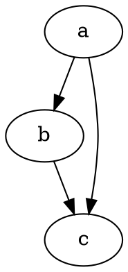

谨以此篇记录与 ·Serverless· 相关的故事，并献给当年的伙伴们。

## 缘起

2016年底，老东家在「国外」AppStore 着急忙慌地上线了一个短视频聊天软件：Clipchat（现已下架）。

功能简单
- 加好友/建群
- 单聊/群聊
- 消息仅限相互之间发送短视频

「题外话」：一款聊天软件却要求用户之间只能以短视频来交流，是不是有些操之过急。

作为当时唯一一个可以迎难而上的服务器端工程师「自诩架构师」，在所有资源都紧张的情况下毫不犹豫地选择了`AWS`，然后基于`AWS`产品搭建出一套全新的后端技术架构。为公司解决燃眉之急并节省了不少成本，也算立下了汗马功劳。

## 使用到的`AWS`服务

| AWS 服务       | 场景              | 备注   |
| ------------ | --------------- | ------ |
| ELB          | 外部负载均衡器         | 1个     |
| ElasticCache | IM消息相关信息存储      |        |
| DynamoDB     | 用户鉴权信息存储        |        |
| RDS          | 存储传统RDMBS数据     |        |
| S3           | Clip资源存储        |        |
| CloudFront   | 内容分发            |        |
| Route53      | 外网DNS解析，内部DNS服务 |        |
| Cognito      | 用于S3文件上传鉴权      | 鉴权部分免费 |
| SQS          | 系统埋点事件存储及后续处理   |        |
| API Gateway  | landpage 数据获取   |        |
| Lambda Function  | landpage 数据获取   |        |

## 转机
上线后，Boss 提出需要增加通过社交账号分享有趣的视频内容来吸引新用户，内容分享者可以基于带来新用户的多少获得相应的奖励。该功能生存时间仅适用于产品发布后的1-2个月。

传统技术方案：
1. 在已完成开发的应用中编写接口，并实现产品逻辑
2. 美工前端完成分享落地页开发
3. 落地页中调用后端接口

这一次有点洁癖，不想因短期需求去侵入核心应用服务的实现逻辑。AWS 这么强大的产品阵容，实现类似这种功能肯定有其他方案。

在扫了几眼`AWS`相关的产品介绍后，又再次思考了下分享功能的诉求，整理出如下大致方案：
- 前端页面直接采用 S3 + CloudFront 完成部署
- 落地页中的 API 由 API Gateway + AWS Lambda + [Dynamodb/后端特殊接口] 

**理由**：凭借 API Gateway 强大的全球部署（API Cache）和伸缩能力；再加上 Lambda 的按需启动的使用计费特性；配合DynamoDB的quota伸缩 —— 所有资源均弹性，可以有效地防范流量突发情况，大流量来临时，只需要付钱就好了。闲时没流量，所有资源低成本（甚至0成本），老板肯定满意。

AWS Lambada Function 是个新东西，好不好用呢 ？16年，国内 AWS 并没有完善的 Lambda 编程体验（宁夏区也并未开放），国内其他云厂商也并未提供类似与之媲美的产品。

## 无服务架构？

自那接触了 AWS Lambda 编程之后，心里便种下了一颗无服务器架构的种子。

